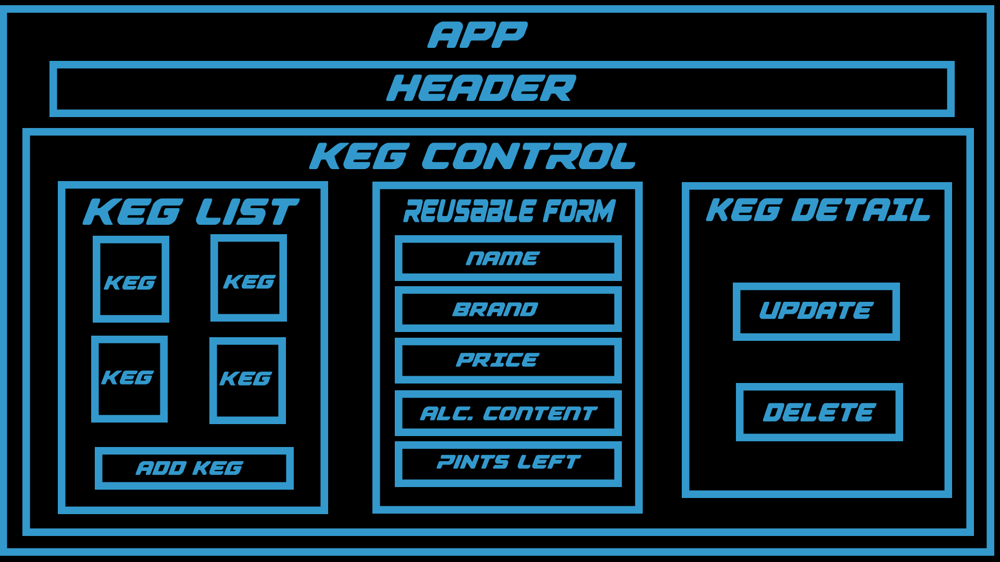

# Keg Tracker

 Authored by Brian Sturgis

Project started on April 23rd, 2021

## Description
This is an application for a Bar to track their keg inventory.

## user stories
As a user can see a list/menu of all available kegs. They can see its name, brand, price and alcoholContent.
A user can submit a form to add a new keg to a list.
A user can click on a keg to see its detail page.
A user can see how many pints are left in a keg. Hint: A full keg has roughly 124 pints.
A user can click a button next to a keg whenever I sell a pint of it. This will decrease the number of pints left by 1. 

### Known Bugs
- keg refill button does not top off keg it adds 124 pints and is not the expectation of the function.
- css styling is set up for layout currently to show rows and columns and not meant for look
- all fields requiring integers must receive them or the keg must be re updated completely for the math to properly reduce the keg amount by one pint at a time.

## Component Diagram

## Stretch Goals
- Implement more CSS/CSS objects

## Technologies Used
- [VS Code](https://code.visualstudio.com/download)
- Git & GitHub
- ES6 JavaScript
- JSX
- React Framework v17.0
- npm
- node.js
- `create-react-app`
- webpack v5.11.1
- Babel
- ESLint
- node.js v15.8.0
- Bootstrap v5.0.0
- Adobe Photo Shop
- Adobe XD
  
### using the application
app must be run from its fundamentals branch

### `npm install`
This app uses node.js. If you do not already have node.js installed, visit https://nodejs.org/en/download/ and install.
After installing node..
- navigate to the root directory of the cloned repo in a as Command Prompt or Git Bash.
- Type in "npm install".
- Type in "npm run build".

### `npm run build`
Builds the app for production to the `build` folder.
It correctly bundles React in production mode and optimizes the build for the best performance.

The build is minified and the filenames include the hashes.
Your app is ready to be deployed!

See the section about [deployment](https://facebook.github.io/create-react-app/docs/deployment) for more information.

### `npm start`
Runs the app in the development mode.
Open [http://localhost:3000](http://localhost:3000) to view it in the browser.

The page will reload if you make edits.
You will also see any lint errors in the console.

### `npm test`
Launches the test runner in the interactive watch mode.
See the section about [running tests](https://facebook.github.io/create-react-app/docs/running-tests) for more information.

### `npm run eject`
**Note: this is a one-way operation. Once you `eject`, you can’t go back!**

If you aren’t satisfied with the build tool and configuration choices, you can `eject` at any time. This command will remove the single build dependency from your project.

Instead, it will copy all the configuration files and the transitive dependencies (webpack, Babel, ESLint, etc) right into your project so you have full control over them. All of the commands except `eject` will still work, but they will point to the copied scripts so you can tweak them. At this point you’re on your own.

You don’t have to ever use `eject`. The curated feature set is suitable for small and middle deployments, and you shouldn’t feel obligated to use this feature. However we understand that this tool wouldn’t be useful if you couldn’t customize it when you are ready for it.

### License
Permission is hereby granted, free of charge, to any person obtaining a copy of this software and associated documentation files (the "Software"), to deal in the Software without restriction, including without limitation the rights to use, copy, modify, merge, publish, distribute, sublicense, and/or sell copies of the Software, and to permit persons to whom the Software is furnished to do so, subject to the following conditions:

The above copyright notice and this permission notice shall be included in all copies or substantial portions of the Software.

THE SOFTWARE IS PROVIDED "AS IS", WITHOUT WARRANTY OF ANY KIND, EXPRESS OR IMPLIED, INCLUDING BUT NOT LIMITED TO THE WARRANTIES OF MERCHANTABILITY, FITNESS FOR A PARTICULAR PURPOSE AND NONINFRINGEMENT. IN NO EVENT SHALL THE AUTHORS OR COPYRIGHT HOLDERS BE LIABLE FOR ANY CLAIM, DAMAGES OR OTHER LIABILITY, WHETHER IN AN ACTION OF CONTRACT, TORT OR OTHERWISE, ARISING FROM, OUT OF OR IN CONNECTION WITH THE SOFTWARE OR THE USE OR OTHER DEALINGS IN THE SOFTWARE..

Copyright (c) 2020 **Brian Micheal Sturgis**